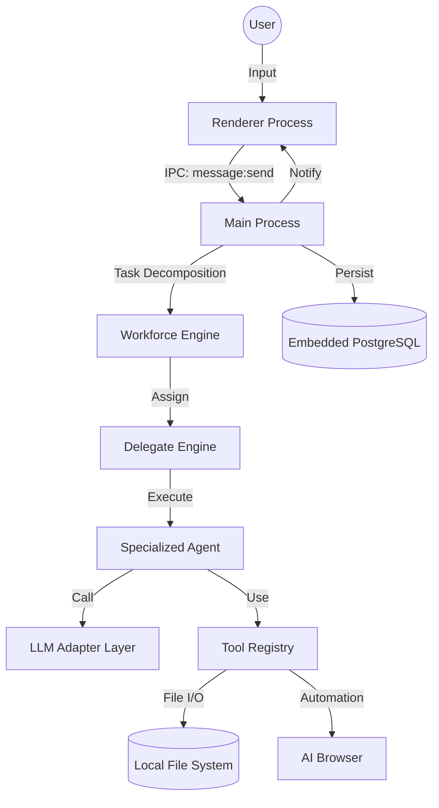

# CodeAll Architecture Documentation

This document describes the high-level architecture and design principles of the CodeAll platform.

## 1. System Overview

CodeAll is a desktop application built on **Electron**, designed to be a Multi-LLM Collaborative Programming Platform. It follows a multi-process architecture to ensure security, performance, and a responsive user experience.

### Process Model

- **Main Process**: Orchestrates the system. It manages the local database (PostgreSQL), executes file system operations, handles LLM provider integrations, and manages the lifecycle of the AI-controlled browser.
- **Renderer Process**: A React-based single-page application (SPA) providing the user interface. It communicates with the Main process via secure IPC channels.
- **Preload Scripts**: Acts as a secure bridge, exposing a limited and validated set of APIs to the Renderer process through `contextBridge`.

---

## 2. Component Design

### 2.1 Workforce & Delegate System

The core logic of CodeAll resides in its ability to decompose complex goals into executable tasks.

- **Workforce Engine**: Responsible for high-level workflow orchestration. It decomposes a user request into a Directed Acyclic Graph (DAG) of sub-tasks.
- **Delegate Engine**: Acts as the dispatcher. It assigns sub-tasks to specialized **Agents** based on their capabilities (e.g., coding, research, testing).
- **Agents**: Atomic units of execution that leverage LLMs and Tools to complete specific tasks.

### 2.2 LLM Adapter Layer

To support multiple providers, CodeAll implements a provider-agnostic adapter layer.

- **Interface**: `LLMAdapter` defines a standard contract for completion and streaming.
- **Implementations**: Support for Anthropic, OpenAI, Google Gemini, and OpenAI-compatible endpoints.
- **Factory**: `createLLMAdapter` dynamically instantiates the correct adapter based on user configuration.

### 2.3 AI-Controlled Browser

Integrated browser automation allows agents to interact with the web.

- **Engine**: Built-in `BrowserView` or `WebContents`.
- **Capabilities**: Navigation, element interaction, console monitoring, network interception, and visual snapshots.
- **Integration**: Seamlessly used by agents via specific browser tools.

### 2.4 Tool Registry

A plugin-like system for extending agent capabilities.

- **Built-in Tools**: File Read/Write, File Tree indexing, Shell execution, and Browser controls.
- **Permission Policy**: Ensures tools are executed within the scope of the user's "Space" and with proper authorization.

---

## 3. Data Flow

---

## 4. State Management & Persistence

### 4.1 Database Schema

CodeAll uses **Prisma** with an **embedded PostgreSQL** instance for robust state management.

- **Space**: Represents a project workspace mapped to a local directory.
- **Session**: A persistent conversation or work stream within a Space.
- **Task & Run**: Track the decomposition and execution history of agent activities.
- **Artifact**: Metadata for files created or modified by the system.
- **AuditLog**: Detailed security and activity tracking for all system actions.

### 4.2 Frontend State

The React frontend uses **Zustand** for lightweight, performant state management, synchronized with the backend via IPC events.

---

## 5. IPC Communication

Communication between the Renderer and Main process is strictly controlled:

1.  **Invoke/Handle**: For request-response patterns (e.g., fetching session history).
2.  **Events (Push)**: For real-time updates (e.g., task progress, LLM streaming, browser state changes).
3.  **Validation**: All IPC messages are validated via a centralized registry and handler system in `src/main/ipc/`.

---

## 6. Security Design

- **Workspace Isolation**: Agents are restricted to the boundaries of the defined "Space" (working directory).
- **Credential Management**: API keys are stored securely using the OS keychain (via `electron.safeStorage`).
- **Audit Logging**: Every sensitive action (config changes, file writes, API calls) is logged for security review.
- **Context Isolation**: Renderer processes have no direct access to Node.js APIs or the local file system.

---

## 7. Technical Selection

| Layer          | Technology                               |
| :------------- | :--------------------------------------- |
| **Runtime**    | Electron                                 |
| **Frontend**   | React, TypeScript, Tailwind CSS, Zustand |
| **Backend**    | Node.js, TypeScript                      |
| **Database**   | PostgreSQL (Embedded), Prisma ORM        |
| **Automation** | Playwright (internal browser driver)     |
| **Build Tool** | electron-vite                            |
