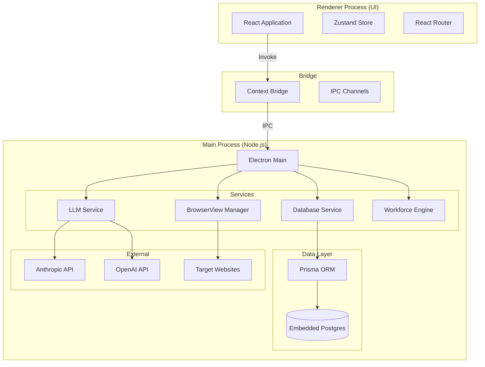
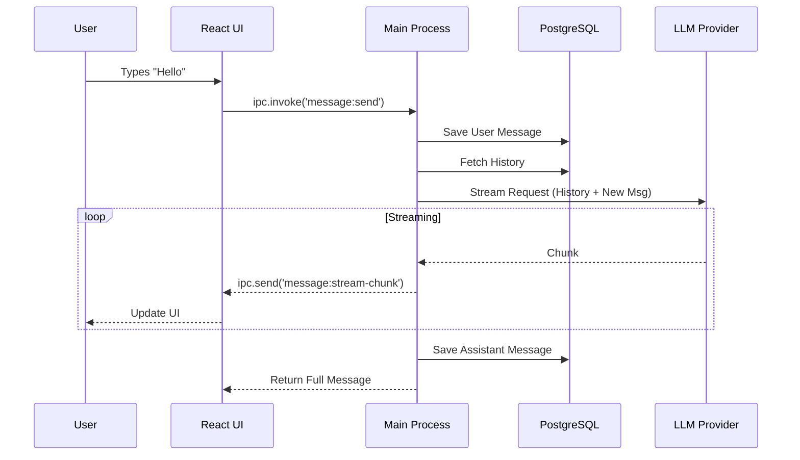
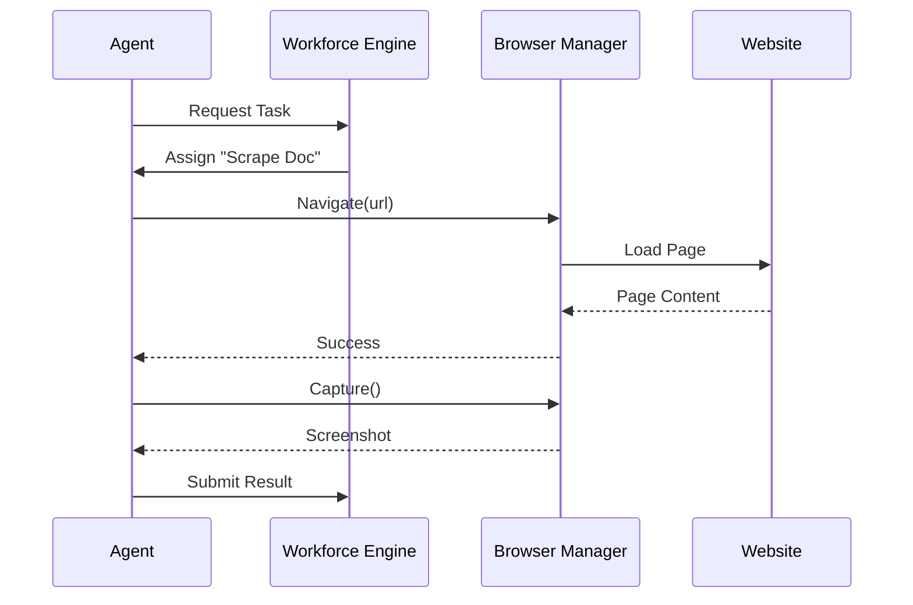

# GodCode Architecture

GodCode is built on a modern Electron architecture, separating concerns between the Main Process (Node.js) and the Renderer Process (React). It leverages local databases, multi-LLM adapters, and browser automation to create a cohesive development environment.

## 1. System Overview

### High-Level Architecture

## 2. Key Components

### 2.1 Main Process (`src/main`)

The backbone of the application, responsible for:

- **Lifecycle Management**: App startup, window creation, cleanup.
- **Database Access**: Singleton `DatabaseService` managing the embedded PostgreSQL instance.
- **IPC Handlers**: Responding to requests from the UI (`src/main/ipc`).
- **LLM Orchestration**: Managing API keys and streaming responses from different providers.

### 2.2 Renderer Process (`src/renderer`)

A React-based Single Page Application (SPA) built with:

- **UI Components**: Shadcn/UI + Tailwind CSS.
- **State Management**: Zustand for global state (sessions, settings).
- **Routing**: React Router for navigation.
- **Code Highlighting**: Prism-react-renderer for code blocks.

### 2.3 Workforce Engine

An intelligent task delegation system:

1. **Input**: User goal ("Create a blog").
2. **Decomposition**: LLM breaks goal into `Task` records.
3. **Execution**: Dedicated agents execute tasks in parallel.
4. **Coordination**: Results are aggregated and returned to the user.

### 2.4 AI Browser (BrowserView)

A controlled browser environment for agents:

- **Implementation**: Electron `BrowserView` (separate from main window).
- **Control**: Agents send commands (navigate, click) via IPC.
- **Vision**: Screenshots are captured and sent to Vision-capable LLMs.

## 3. Data Flow

### 3.1 Chat Message Flow

### 3.2 Task Execution Flow

## 4. Design Decisions

### 4.1 Embedded Database

**Decision**: Use `embedded-postgres` instead of SQLite.

- **Why**: Full PostgreSQL feature set (Vector search ready), no external dependency for users, consistent with server deployments.

### 4.2 IPC-First Design

**Decision**: All logic resides in Main; Renderer is purely presentation.

- **Why**: Security (no Node.js in renderer), centralization of business logic, easier testing of core services.

### 4.3 LLM Adapter Pattern

**Decision**: Abstract LLM providers behind a common interface.

- **Why**: Allows swapping providers (Anthropic, OpenAI, Local models) without changing application logic.
