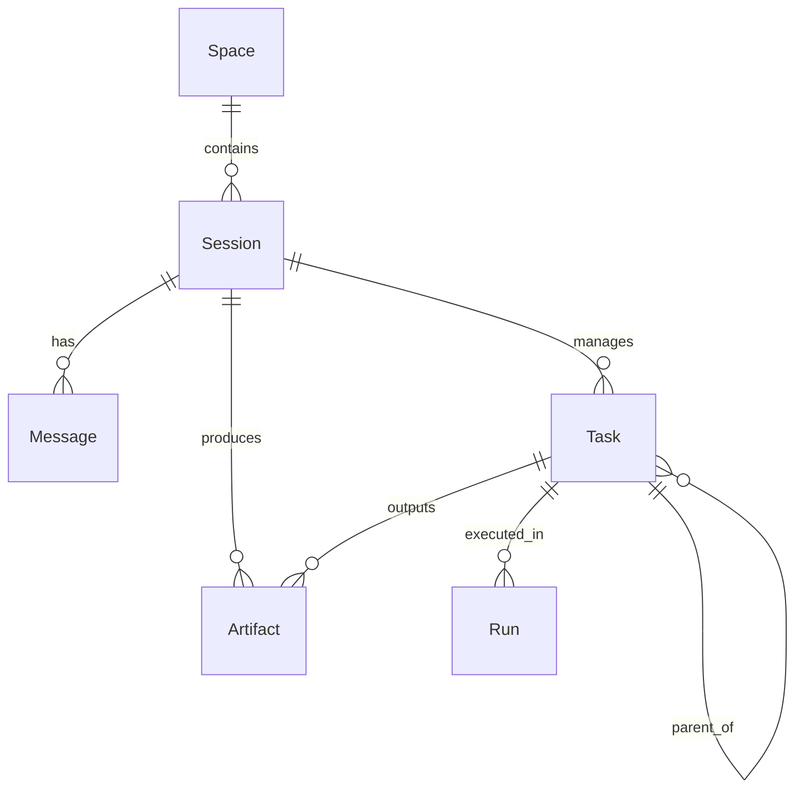

# Database Schema Documentation

This document describes the database structure for GodCode, which uses PostgreSQL managed through Prisma ORM.

## Entity Relationship Diagram (ERD)



## Models

### Space

A `Space` represents a workspace mapped to a local directory. It is the root container for all sessions and data.

| Field       | Type            | Description                           |
| :---------- | :-------------- | :------------------------------------ |
| `id`        | `String (UUID)` | Primary Key                           |
| `name`      | `String`        | Display name of the space             |
| `workDir`   | `String`        | Path to the local workspace directory |
| `createdAt` | `DateTime`      | Timestamp when created                |
| `updatedAt` | `DateTime`      | Timestamp when last updated           |

### Session

A `Session` is a logical grouping of messages, tasks, and artifacts. Usually corresponds to a single conversation or objective.

| Field       | Type            | Description                                 |
| :---------- | :-------------- | :------------------------------------------ |
| `id`        | `String (UUID)` | Primary Key                                 |
| `spaceId`   | `String`        | Foreign Key to `Space`                      |
| `title`     | `String`        | Title of the session                        |
| `status`    | `String`        | Current status (e.g., "active", "archived") |
| `createdAt` | `DateTime`      | Timestamp when created                      |
| `updatedAt` | `DateTime`      | Timestamp when last updated                 |

### Message

Stores the conversation history within a session.

| Field       | Type            | Description                                   |
| :---------- | :-------------- | :-------------------------------------------- |
| `id`        | `String (UUID)` | Primary Key                                   |
| `sessionId` | `String`        | Foreign Key to `Session`                      |
| `role`      | `String`        | Message role: "user", "assistant", "system"   |
| `content`   | `String (Text)` | Content of the message                        |
| `metadata`  | `Json`          | Additional metadata (tool calls, usage, etc.) |
| `createdAt` | `DateTime`      | Timestamp when created                        |

### Task

Represents an executable unit of work. Tasks can be nested to form a hierarchy (DAG).

| Field           | Type             | Description                                                          |
| :-------------- | :--------------- | :------------------------------------------------------------------- |
| `id`            | `String (UUID)`  | Primary Key                                                          |
| `sessionId`     | `String`         | Foreign Key to `Session`                                             |
| `parentTaskId`  | `String?`        | Optional link to a parent task for hierarchy                         |
| `type`          | `String`         | Type of task (e.g., "research", "code", "test")                      |
| `status`        | `String`         | Status: "pending", "in_progress", "completed", "failed", "cancelled" |
| `input`         | `String (Text)`  | Task prompt or input data                                            |
| `output`        | `String? (Text)` | Resulting output or response                                         |
| `assignedModel` | `String?`        | ID or name of the model assigned to this task                        |
| `assignedAgent` | `String?`        | Name of the specialized agent assigned                               |
| `metadata`      | `Json`           | Task-specific configuration or results                               |
| `createdAt`     | `DateTime`       | Creation timestamp                                                   |
| `startedAt`     | `DateTime?`      | When execution started                                               |
| `completedAt`   | `DateTime?`      | When execution finished                                              |

### Run

An execution instance of a task. Used for tracking multiple attempts, logs, and resource usage.

| Field         | Type            | Description                           |
| :------------ | :-------------- | :------------------------------------ |
| `id`          | `String (UUID)` | Primary Key                           |
| `taskId`      | `String`        | Foreign Key to `Task`                 |
| `status`      | `String`        | Status of this specific run           |
| `logs`        | `Json`          | Array of execution logs               |
| `tokenUsage`  | `Json`          | Breakdown of prompt/completion tokens |
| `cost`        | `Float?`        | Calculated cost of the run            |
| `startedAt`   | `DateTime`      | Start timestamp                       |
| `completedAt` | `DateTime?`     | Completion timestamp                  |

### Artifact

Files, code blocks, or data structures generated during a session or task.

| Field       | Type             | Description                               |
| :---------- | :--------------- | :---------------------------------------- |
| `id`        | `String (UUID)`  | Primary Key                               |
| `sessionId` | `String`         | Foreign Key to `Session`                  |
| `taskId`    | `String?`        | Optional link to the task that created it |
| `type`      | `String`         | e.g., "file", "code_block", "image"       |
| `path`      | `String`         | Reference path or identifier              |
| `content`   | `String? (Text)` | Content of the artifact if stored inline  |
| `size`      | `Int`            | Size in bytes                             |
| `createdAt` | `DateTime`       | Creation timestamp                        |
| `updatedAt` | `DateTime`       | Update timestamp                          |

### Configuration & Utilities

- **Model**: Stores available LLM model configurations (provider, name, base URL).
- **ApiKey**: Secure storage for provider API keys (encrypted).
- **SchemaVersion**: Simple table to track the applied schema/migration version.
- **AuditLog**: Comprehensive log of system activities, security events, and configuration changes.

## Relationships

1. **Space -> Session**: One Space can have many Sessions. When a Space is deleted, its sessions are typically archived or deleted.
2. **Session -> Message/Task/Artifact**: A Session acts as the primary context for all AI activity.
3. **Task -> Run**: Each Task can have multiple Runs (e.g., retries or iterative improvements).
4. **Task -> Task (Parent/Child)**: Tasks can form trees, allowing complex goals to be broken down into sub-tasks.

## Indexing Strategy

To ensure high performance for retrieval, the following indices are maintained:

- **Foreign Keys**: `spaceId` in `Session`, `sessionId` in `Message`/`Task`/`Artifact`, `taskId` in `Run`.
- **Status Fields**: `status` in `Session`, `Task`, and `Run` for quick dashboard updates.
- **Searchable Fields**: `role` in `Message`, `type` in `Task` and `Artifact`.
- **Compound Indices**: `Model(provider, modelName)` for efficient lookups.

## Example Queries

### Fetching all tasks in a session with their latest runs

```sql
SELECT t.*, r.*
FROM "Task" t
LEFT JOIN "Run" r ON t.id = r."taskId"
WHERE t."sessionId" = 'target-session-id'
ORDER BY t."createdAt" ASC, r."startedAt" DESC;
```

### Prisma: Finding all children of a task

```typescript
const subtasks = await prisma.task.findMany({
  where: { parentTaskId: 'parent-id' },
  include: { runs: true }
})
```

### Calculating total token usage for a session

```sql
SELECT SUM(CAST(json_extract_path_text("tokenUsage", 'totalTokens') AS INTEGER))
FROM "Run"
WHERE "taskId" IN (SELECT id FROM "Task" WHERE "sessionId" = 'target-session-id');
```

---

Ultraworked with [Sisyphus](https://github.com/code-yeongyu/oh-my-opencode)
