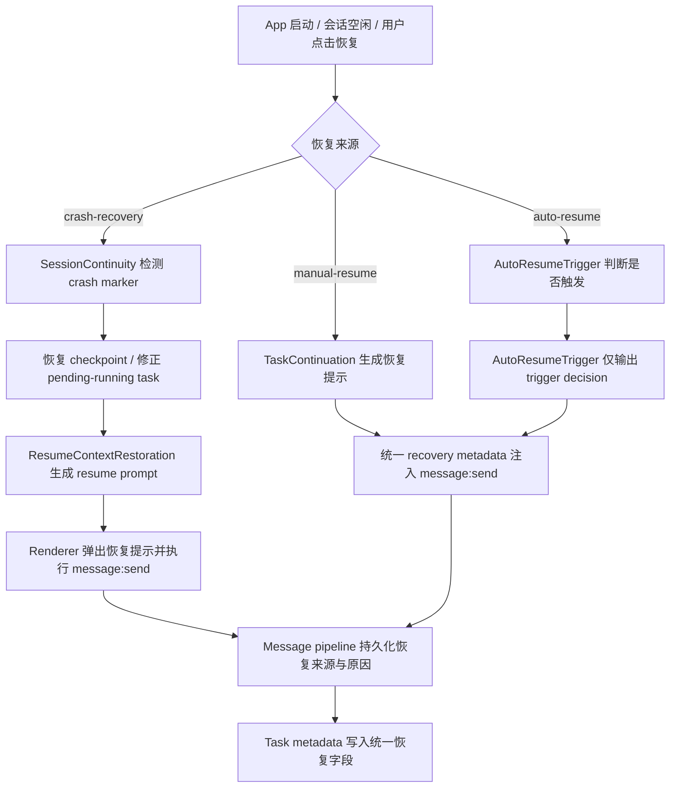

# WP-03 恢复链统一说明

## 1. 统一目标

本轮将恢复能力统一为三层：

1. `Session Recovery`：处理 crash marker、session checkpoint、pending/running task 状态修正。
2. `Task Resumption`：处理手动恢复、自动恢复触发、TODO 续跑提示。
3. `Resume Context Reconstruction`：为 UI 和 LLM 生成统一的恢复来源、原因、阶段、动作与提示词。

统一字段定义在 `src/shared/recovery-contract.ts`：

- `resumeReason`
- `recoverySource`
- `recoveryStage`
- `resumeAction`

## 2. 恢复流程图

## 3. 恢复字段说明表

| 字段 | 含义 | 典型值 |
|---|---|---|
| `recoverySource` | 恢复来源 | `crash-recovery` / `manual-resume` / `auto-resume` |
| `resumeReason` | 触发恢复的直接原因 | `crash-detected` / `interrupted-tasks` / `in-progress-todo` / `pending-todos` / `pending-plan-tasks` / `session-active` |
| `recoveryStage` | 当前恢复所处阶段 | `detected` / `session-recovery` / `task-resumption` / `context-rebuild` / `prompt-ready` / `completed` / `failed` |
| `resumeAction` | 当前建议或执行动作 | `show-recovery-dialog` / `restore-session` / `resume-tasks` / `rebuild-context` / `send-resume-prompt` / `auto-send-resume-prompt` |
| `recoveryUpdatedAt` | 最近一次恢复状态更新时间 | ISO 时间戳 |

## 4. 用户可见行为

### 4.1 Crash recovery
- 应用启动后若检测到 crash marker，会把会话标记为 `crashed`。
- Renderer 使用 `session-recovery:list` 拉取恢复候选并展示 `SessionRecoveryPrompt`。
- 用户点击恢复后，会先执行 `session-recovery:execute`，再通过 `session-recovery:resume-prompt` + `message:send` 继续主链。

### 4.2 Manual resume
- `SessionResumeIndicator` 通过 `task-continuation:get-status` 获取统一恢复标签。
- UI 直接展示来源、原因、动作，不再只显示笼统的 “Session interrupted”。
- 点击恢复会把统一 `resumeContext` 透传到 `message:send`，并同步写入 TODO task metadata。

### 4.3 Auto resume
- `AutoResumeTriggerService` 只负责 idle + work summary 的触发判断，不再重复承载恢复上下文拼装。
- 其输出统一为 `ResumeDecision + recoveryContext`，可被后续主链复用。

## 5. 代码落点

- 共享契约：`src/shared/recovery-contract.ts`
- task metadata 标记：`src/main/services/recovery-metadata.service.ts`
- crash recovery：`src/main/services/session-continuity.service.ts`
- manual resume：`src/main/services/task-continuation.service.ts`
- auto trigger：`src/main/services/auto-resume-trigger.service.ts`
- context reconstruction：`src/main/services/session-state-recovery.service.ts`、`src/main/services/resume-context-restoration.service.ts`
- renderer UI：`src/renderer/src/components/session/SessionResumeIndicator.tsx`、`src/renderer/src/components/session/SessionRecoveryPrompt.tsx`

## 6. 本轮边界

- `SessionContinuityService` 现已把恢复执行细节外提到 `src/main/services/session-recovery-executor.service.ts`，自身主要保留 checkpoint / crash marker / state transition 责任。
- 本轮已经统一字段、打通 crash/manual UI、收敛 auto-resume 触发职责，并补齐专项测试矩阵。
